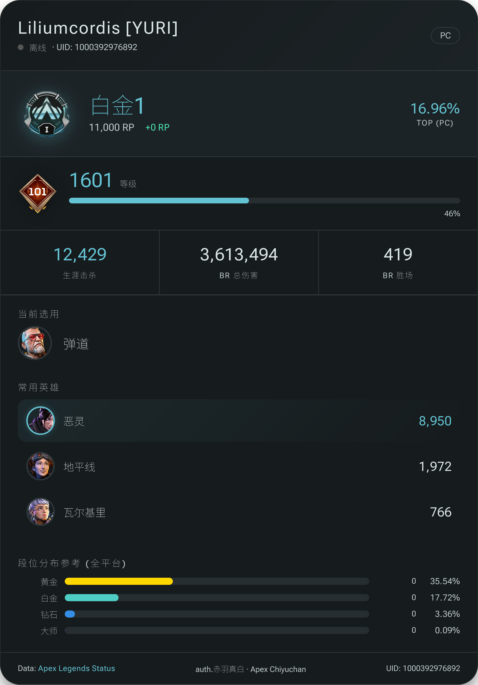
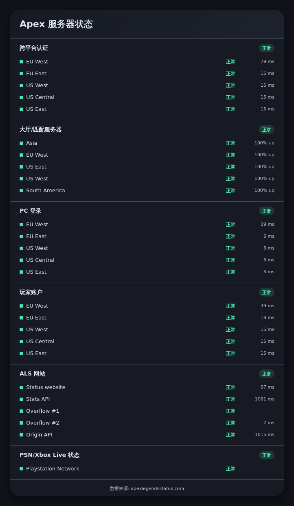
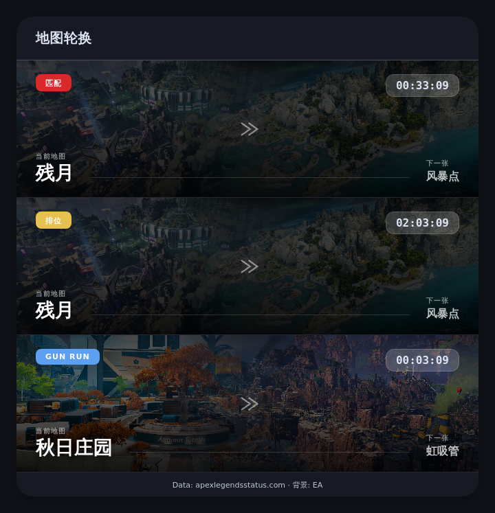
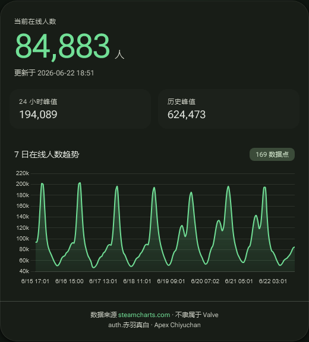
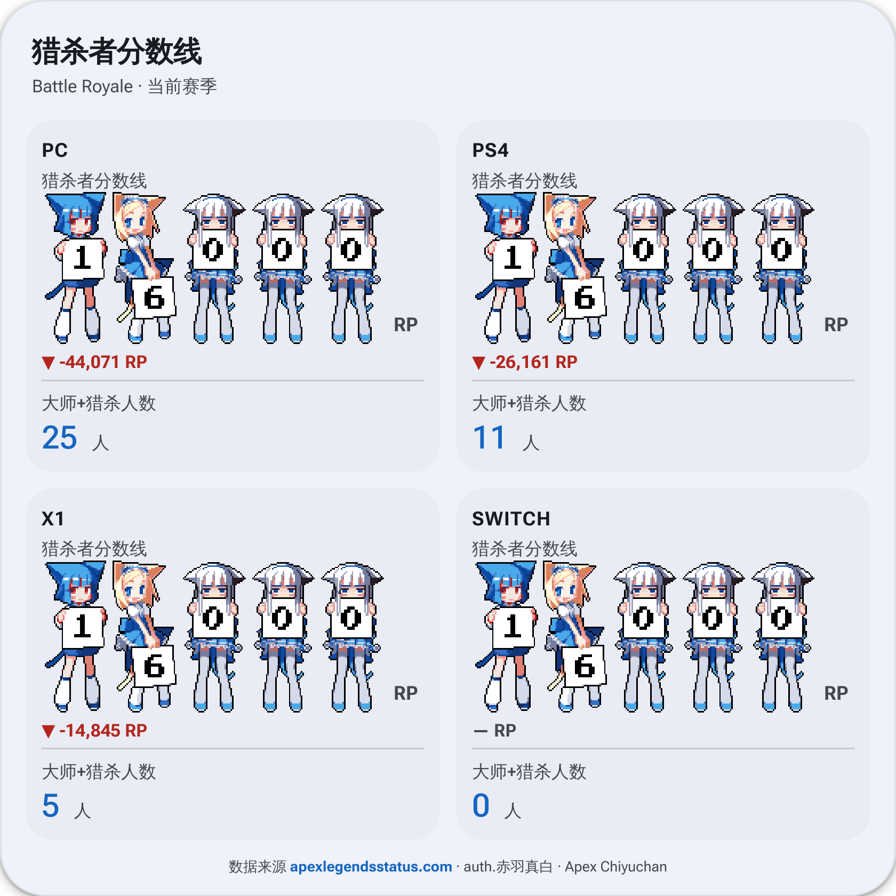
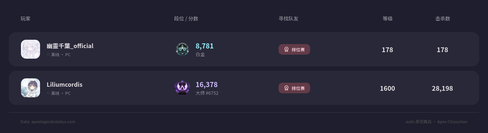

<h1 align="center">⚡ 小赤羽 / AstrBot Apex 数据查询插件</h1>

<p align="center">
  <b>一个专注于 Apex 英雄数据查询 · 地图轮换 · 组队 · 服务器状态追踪的 AstrBot 多功能插件</b>
</p>

<p align="center">
  
</p>

<p align="center">
  <a href="https://astrbot.app">
    
  </a>
  
  
  <a href="https://github.com/LilycleHeart/astrbot_plugin_apex_chiyuchan/blob/master/LICENSE">
    
  </a>
</p>

<p align="center">
  <a href="#-卡片预览">卡片预览</a> ·
  <a href="#-特性一览">特性</a> ·
  <a href="#-指令列表">指令</a> ·
  <a href="#-安装">安装</a> ·
  <a href="#-配置">配置</a> ·
  <a href="#-数据来源">数据来源</a>
</p>

---

## 🖼️ 卡片预览

<table align="center" cellpadding="8">
  <tr>
    <td align="center" valign="top" width="50%">
      <b>📊 战绩查询</b><br />
      
    </td>
    <td align="center" valign="top" width="50%">
      <b>🌐 服务器状态</b><br />
      
    </td>
  </tr>
  <tr>
    <td align="center" valign="top" width="50%">
      <b>🗺️ 地图轮换</b><br />
      
    </td>
    <td align="center" valign="top" width="50%">
      <b>🏆 赛季信息</b><br />
      
    </td>
  </tr>
  <tr>
    <td align="center" valign="top" width="50%">
      <b>📈 Steam 日活</b><br />
      
    </td>
    <td align="center" valign="top" width="50%">
      <b>👑 猎杀 / 大师</b><br />
      
    </td>
  </tr>
  <tr>
    <td colspan="2" align="center">
      <b>👥 找队友 / LFG</b><br />
      
    </td>
  </tr>
</table>

---

## ✨ 特性一览

### 📊 战绩查询

实时获取玩家数据并生成可视化卡片：

- 段位 / RP / 排名 / RP 变动趋势
- 击杀数、伤害、胜场等基础统计
- 常用英雄 TOP 数据
- 当前赛季排位徽章展示
- 当前传奇使用情况
- 段位分布参考

> ⚠️ 数据来源于第三方 API，可能存在延迟、缺失或短时间不可用。

---

### 🗺️ 地图轮换

支持查询 Apex 当前地图轮换信息：

- 匹配模式当前地图与下一张地图
- 排位模式当前地图与下一张地图
- 混合模式地图轮换
- 外卡模式地图轮换
- 剩余轮换时间
- 自动生成官方风格地图卡片

---

### 🌐 服务器状态

查看 Apex 相关服务运行状态：

- 跨平台认证状态
- 大厅 / 匹配服务器状态
- PC 登录服务状态
- 玩家账户服务状态
- Apex Legends Status API 状态
- PSN / Xbox Live 状态
- 延迟与可用性展示

---

### 👑 猎杀 / 大师数据

查看当前赛季猎杀者 / 大师分数线：

- PC / PS4 / Xbox / Switch 四平台数据
- 猎杀者分数线
- 24 小时 RP 变化
- 大师 + 猎杀人数统计
- Moe Counter 风格可视化展示

---

### 🏆 赛季信息

查看当前赛季与分区信息：

- 当前赛季名称
- 当前 Split 分区
- Split 结束倒计时
- 赛季结束日期
- META 英雄胜率 Top 6

---

### 👥 找队友系统 LFG

面向群聊场景的找队友功能：

- 按群隔离的找队友列表
- 支持排位 / 娱乐模式
- 展示玩家段位、等级、击杀数等信息
- 实时在线状态
- 30 分钟缓存战绩数据，减少 API 请求
- 管理员可代为注册 / 退出

---

### 📈 Steam 日活

查询 Apex Legends Steam 在线人数趋势：

- 当前在线人数
- 24 小时峰值
- 历史峰值
- 近 7 天在线人数趋势图
- 约 169 个数据点
- MD3 风格卡片
- 支持深色 / 浅色主题

---

### 🌓 北京时区明暗主题

卡片支持按北京时间自动切换明暗主题：

- `06:00 - 18:00` 使用亮色主题
- 其余时间使用深色主题
- 适用于地图、服务器、猎杀大师、赛季、在线人数等卡片

---

### 💾 图片缓存

插件支持图片永久磁盘缓存，避免每次渲染都重新下载远程图片，显著提升渲染速度：

- 缓存目录：`assets/image_cache/`
- 永久保存，不会过期
- 最大缓存大小：500MB（超限时自动清理最旧文件）
- 支持手动清理和统计查看

---

### 🤖 LLM 自然语言支持

开启 LLM 后，可以直接使用自然语言触发查询：

```text
看看我的战绩
现在什么地图
服务器炸了吗
大师多少分了
现在多少人在线
现在什么赛季
```

插件会自动识别意图，并返回结构化结果与对应卡片。

---

## 📖 指令列表

| 指令 | 说明 |
| --- | --- |
| `/stats [玩家名]` | 查询 Apex 玩家战绩 |
| `/bind <玩家名> [平台]` | 绑定 Apex 账号 |
| `/bind_uid <UID> [平台]` | 通过 UID 绑定 Apex 账号 |
| `/unbind` | 解绑当前账号 |
| `/map` | 查询地图轮换 |
| `/server` | 查询服务器状态 |
| `/master` | 查询猎杀 / 大师分数线 |
| `/season` | 查询当前赛季信息 |
| `/lfg <排位\|娱乐\|列表\|退出>` | 找队友系统 |
| `/online` | 查询 Steam 日活 / 在线人数 |
| `/cache stats` | 查看缓存统计信息 |
| `/cache clear` | 清空所有缓存 |
| `/cache cleanup` | 清理超限缓存 |

平台参数通常可使用：

```text
PC / PS4 / X1 / SWITCH
```

---

## 📦 安装

在 AstrBot 插件管理中，选择「安装插件」，输入以下链接即可：

```text
https://github.com/LilycleHeart/astrbot_plugin_apex_chiyuchan
```

---

## ⚙️ 配置

插件需要配置 Apex Legends Status API Key。

```json
{
  "apex_api_key": "YOUR_API_KEY"
}
```

API Key 获取地址：

[https://portal.apexlegendsapi.com](https://portal.apexlegendsapi.com)

### 配置项说明

| 配置项 | 必填 | 说明 |
| --- | --- | --- |
| `apex_api_key` | 是 | Apex Legends Status API Key |

---

## 🔧 环境依赖

| 依赖 | 用途 |
| --- | --- |
| `httpx` | API 请求 |
| `aiosqlite` | 本地数据存储 |
| `playwright` | 卡片渲染 |
| `jinja2` | HTML 卡片模板 |
| `mcp` | LLM 工具返回 |

安装依赖后，需要安装 Playwright 浏览器内核：

```bash
python -m playwright install webkit
```

如果你的环境缺少系统依赖，可根据 Playwright 提示补充安装。

---

## 📚 数据来源

- Apex 数据：[apexlegendsstatus.com](https://apexlegendsstatus.com)
- Apex API：[portal.apexlegendsapi.com](https://portal.apexlegendsapi.com)
- Steam 日活：[steamcharts.com/app/1172470](https://steamcharts.com/app/1172470)
- Moe Counter：[github.com/journey-ad/Moe-Counter](https://github.com/journey-ad/Moe-Counter)
- 地图资源：[EA Apex Legends Maps Hub](https://www.ea.com/zh-hant/games/apex-legends/apex-legends/game-objects/maps-hub)

---

## ⚠️ 免责声明

- 本项目为非官方 AstrBot 插件。
- 本项目与 Electronic Arts、Respawn Entertainment、Valve、Steam、Apex Legends Status 均无从属或合作关系。
- Apex Legends 及相关素材版权归其各自权利方所有。
- 第三方 API 数据可能存在延迟、缺失或不可用情况，请以游戏内实际数据为准。
- 请合理控制查询频率，避免触发第三方 API 限流。

---

## ⭐ 支持项目

<p align="center">
  如果觉得好用，欢迎给项目点一个 Star ⭐
</p>

<p align="center">
  <a href="https://github.com/LilycleHeart/astrbot_plugin_apex_chiyuchan">
    
  </a>
</p>

---

## ❤️ 赞助

<p align="center">
  
</p>

<p align="center">
  <b>感谢支持 小赤羽 / Apex 插件</b>
</p>
